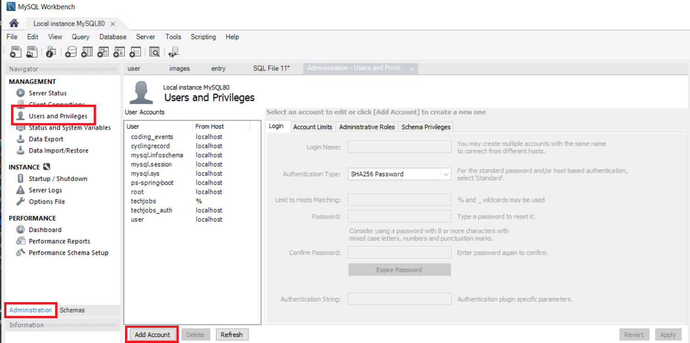
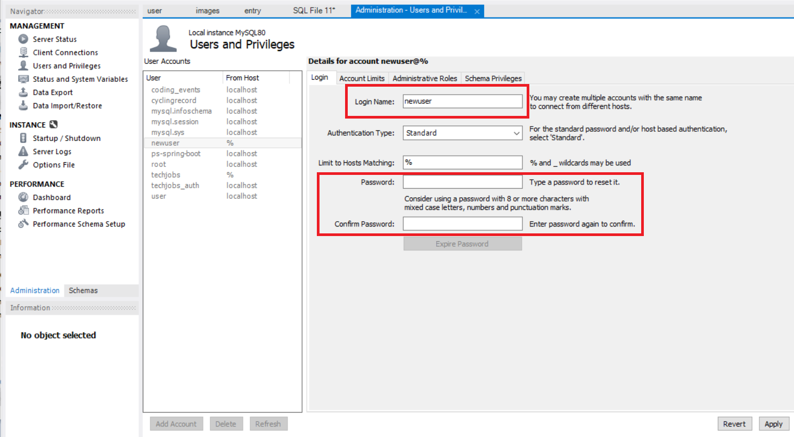
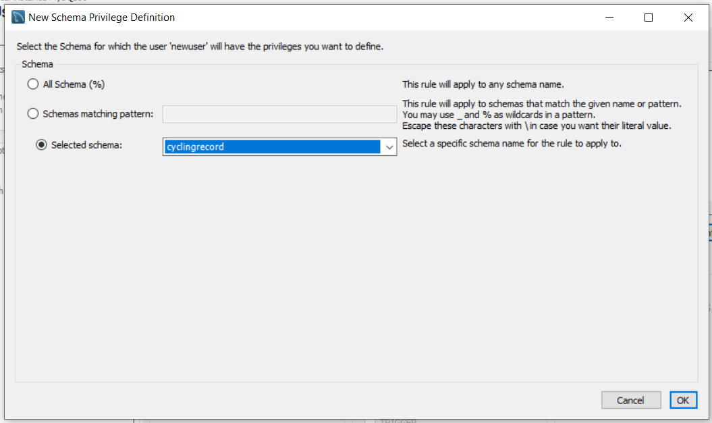
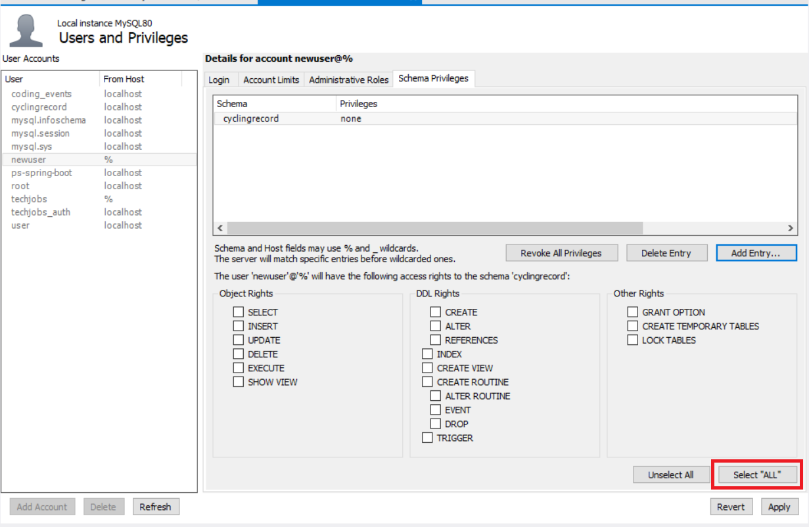

# Overview
For my project I aim to make an app that records data in regards to cycling enthusiasts. The idea came from my father, who is a cyclist himself. He has an excel spreadsheet that he currently uses to record his time, distance and speed on rides, but is frustrated with how it is clunky and how he has to hard code the dates each time a new month rolls around.

# Features
Sign Up/Sign In - allow users to sign up for the app and use their login credentials to input and access their data. Data Input - allow users to input their time and distance by date Data Retrival - returns a table and graph that shows their monthly statistics including an automatically calculated speed. Gallery Feature - allow users to upload pictures of their rides and view them

# Technologies
Java Spring Boot MySQL Hibernate Thymeleaf templates CSS/Bootstrap

# What I'll Have to Learn
How to add upload capabilities to a website How to create dynamic Java graph How to calculate weekly totals and only display on "Sunday" of the table

[Project Tracker](https://trello.com/b/o910BQyV/cycling-project)

# How to Run on Local Machine
+ Navigate to desired folder location via terminal
+ Clone repo using `git clone https://github.com/mcullins/cycling_report_v2.git`
+ If necessary, download [Java JDK](https://www.oracle.com/java/technologies/downloads/)
    + If necessary set JAVA_HOME environmental variable to Java installation location (i.e. C:\Program Files\Java\jdk-17.0.1)
+ If necessary, download [MySQL Workbench](https://dev.mysql.com/downloads/workbench/)
+ In MySQL Workbench, open a new query tab then create a new schema by running `CREATE SCHEMA cyclingrecord;`
+ Create a new user with schema privileges:
    1. Click the Administration tab
    2. Click Users and Privileges
    3. Click Add Account

    4. Create username and desired password

    5. Navigate to Schema Privileges tab and click Add Entry
    6. Choose Selected Schema and pick "cyclingrecord" from provided dropdown

    7. Under the privileges click "Select 'ALL'" (Note: depending on the local machine it may be necessary to widen the viewing window for this option)
 
    8. Click "Apply"
+ Navigate in cloned repo to "src/main/resources/application.properties" and change "spring.datasource.username" variable
to the user just created in MySQL Workbench as well as "spring.datasource.password" to the created password.
+ In a terminal, run `gradlew bootRun`. Application will be ready when output says something similar to:
>2022-11-28 14:12:38.145  INFO 980 --- [  restartedMain] c.c.CyclingRecordApplication             : Started CyclingRecordApplication in 18.304 seconds (JVM running for 21.995)
+ Navigate to localhost:8080 in a browser window
+ Application should be running and ready for demo
    + Register for an account
    + Click "Return to Entry Form" and input data 
    + Click "Gallery" and upload images (NOTE: to avoid images being too big for upload,
    please use images provided in the "static/example_pics" folder in this repo)
